#Project 1: Text Mining among Edgar Allan Poe, HP Lovecraft, and Mary Shelley
***

##Project Description
***
* Project title: The difference and similarity among three authors: Edgar Allan Poe(EAP), HP Lovecraft(HPL), Mary Shelley(MWS).
* This project is conducted by SIle Yang, UNI: sy2738
* Project summary: This project is to study the text structure, the number of words(including part of speech), the style of words, the sentiment analysis in sentence level and finally, the specific words among three famous spooky authors. 


## Text Structure
***

#### 1. sentence length and word length
***

First, let's analyze the text structure first.
##### Numbers of text, sentences length and words length
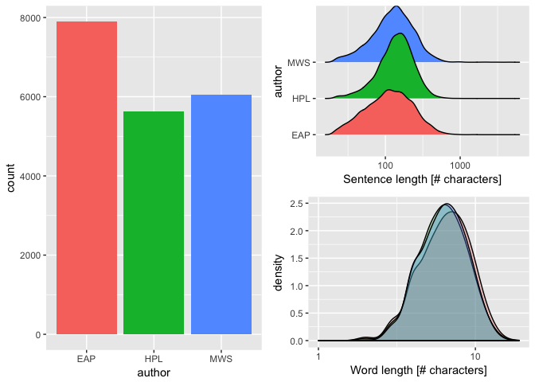<!-- -->
  
Above plots show that EAP is featured mostly, comparing with HPL and MWS. In this dataset, EAP has 7900 texts, more than MWS(6044) and HPL(5635).
In addition, EAP prefer short sentence as well as long sentence, comparing with HPL, who obviously prefer long sentence more. The sentence for EAP is more variable. 

#### 2. part of speech 
***

Second, let's do analysis of part of speech.  
I create one function to get part of speech of three authors. (You can find this function in `Libs`). The function would create dataset including token(word), pos and author name separately. I merged three datasets into one and analyzed the part of speech.   

  
Many literary criticisms hold that HPL uses a lot of adjective words and criticizes such words make his novel too abstract and empty. But HPL insists it is a way to show indescribable fearness. Based on POS analysis, we can check whether HPL uses more adjective words than other authors.   

##### Proportion of part of speech  

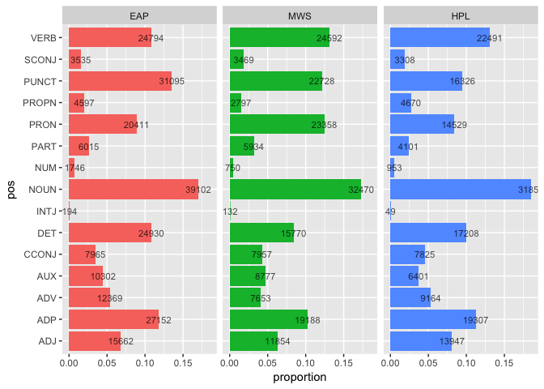<!-- -->
  
Above plot confirms such criticism: it's certain that HPL uses a lot of ADJ(nearly 0.075%), compared with EAP(proportion: 0.065) and MWS(proportion 0.06).  
In addtion, we can find noun takes the biggest part. MWS and HPl are more likely to use VERB than EAP. EAP uses more PUNCT than VERB in his sentences.  

## Word Frequencies
***

#### 1. Which word they love most?
***
It is `time`!  

##### Word Cloud of EAP, HPL and MWS

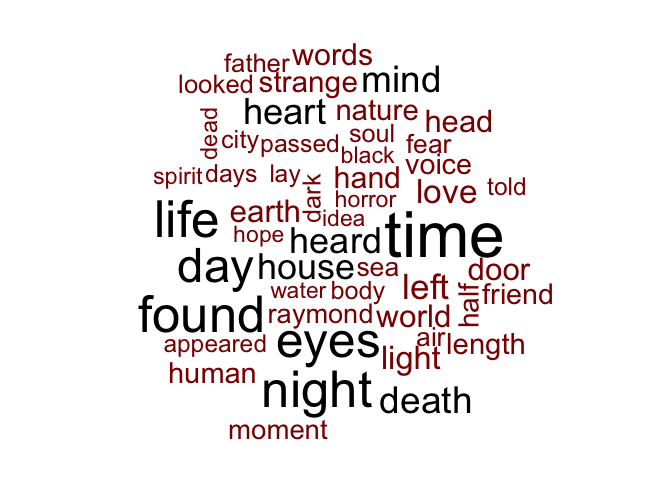<!-- -->
  
In this word cloud picture, it is obvious that "time", "night", "life", "day"... are frequent word. Sounds far from spooky! However, we can find "death" "dark", "strange" such horrible words as well.  

##### Word Cloud of EAP  

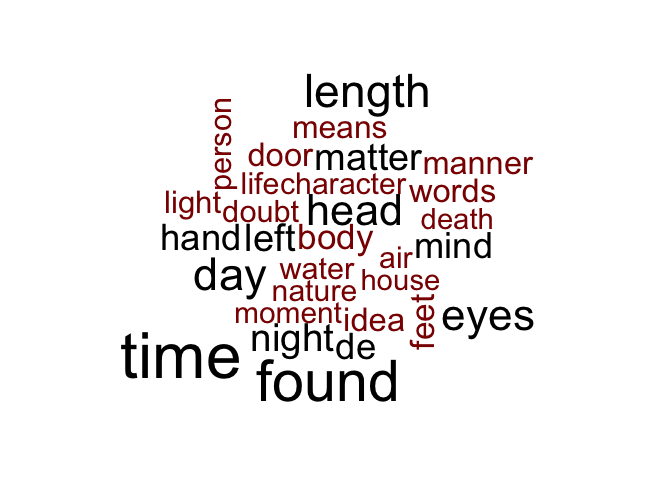<!-- -->
  
In EAP's word cloud, the most frequent word is "found","day","time","length"... It seems too normal for a spooky novel.  

##### Word Cloud of HPL
<!-- -->
  
HPL loves "night" and "time "too! Different from EAP, HPL has some words related with location, such as "house" "street"... It is related with his story, which talk a lot about ancient gods and thier remains.  

##### Word Cloud of MWS
  
MWS talks more about positive words: "love", "hope","friend", "heart" as well as some spooky words: "fear", "death", "passed", "perdita". It is easy to infer that the author is woman when you only see this word cloud plot, because the words are more emotional.  
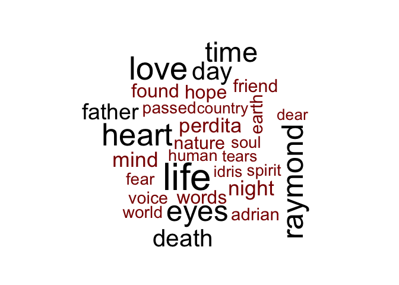<!-- -->

#### 2. Correlation of word frequencies
***

Secondly, I compared the word frequencies of EAP, HPL and MWS. I calculate the proportion of HPL and MWS's word frequencies of EAP's.  
##### Proportion of HPL and MWS of EAP 
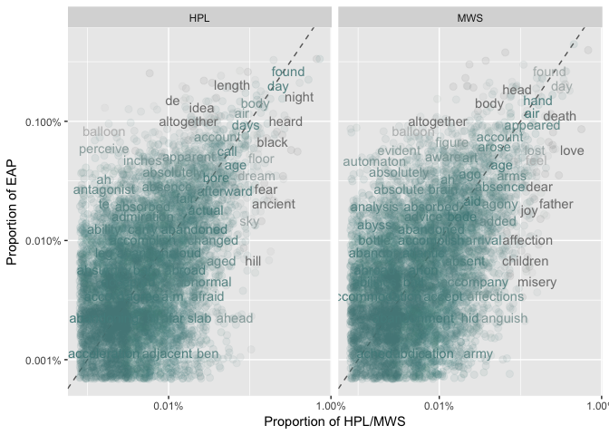<!-- -->
  
The plot shows that both HPL and MWS has same-level similarity with EAP. They do not have high similarities of word choice.  
We can also use correlation test to analyze the similarity and difference of word frequencies. The below output shows the correlations between EAP and HPL and EAP and MWS.  
##### Correlation test between EAP and HPL

```
## 
## 	Pearson's product-moment correlation
## 
## data:  proportion and EAP
## t = 68.515, df = 7134, p-value < 2.2e-16
## alternative hypothesis: true correlation is not equal to 0
## 95 percent confidence interval:
##  0.6157761 0.6437702
## sample estimates:
##       cor 
## 0.6299777
```
##### Correlation test between EAP and MWS

```
## 
## 	Pearson's product-moment correlation
## 
## data:  proportion and EAP
## t = 65.716, df = 6799, p-value < 2.2e-16
## alternative hypothesis: true correlation is not equal to 0
## 95 percent confidence interval:
##  0.6085015 0.6375775
## sample estimates:
##       cor 
## 0.6232549
```
  
The output of test is same as output of plot: HPL and MWS has almost same correlation with EAP's word frequencies.   

#### 3.tf-idf test
***
  
Based on part of speech dataset, I filtered adjective words of three author's text and did a tf-idf test. I assume that HPL has the most unique adjective words!  
##### tf-values of EAP, MWS and HPL (Adjective words)  
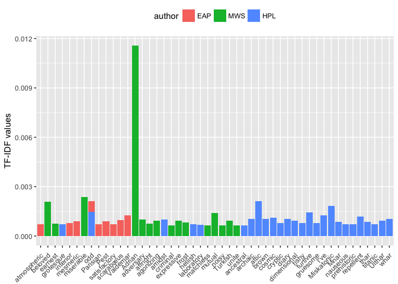<!-- -->
  
There is no surperise! Expect for MWS's "Adrian", we can see HPL has a string of strange and spooky adjective words. EAP does not use a lot unique adjective words.   
I did tf-idf analysis separately by ungrouping three authors. We can see EAP prefer normal adjective words such like "odd", "nice", "unnecessary" - that the reason why his tf-value is not so high. HPL has a lot of negative words, which fits his own style.  
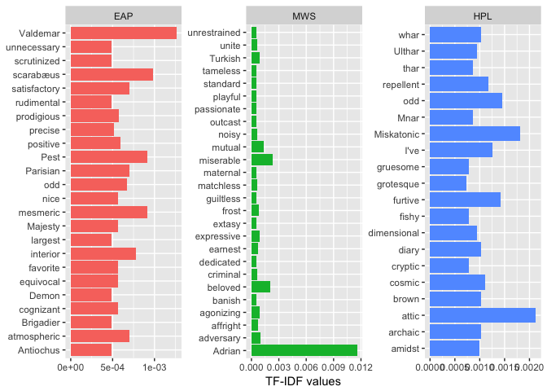<!-- -->

## Sentiment analysis in Sentence Level   
***

In this part, I did a sentiment analysis in sentence level. I split each sentence into several words and calculated the sentiments score of words via "afinn". Then I added the score of words and got a total score of each sentence. Thus, I can analyze sentiment in sentence level. 

##### sentiment score in sentence level  
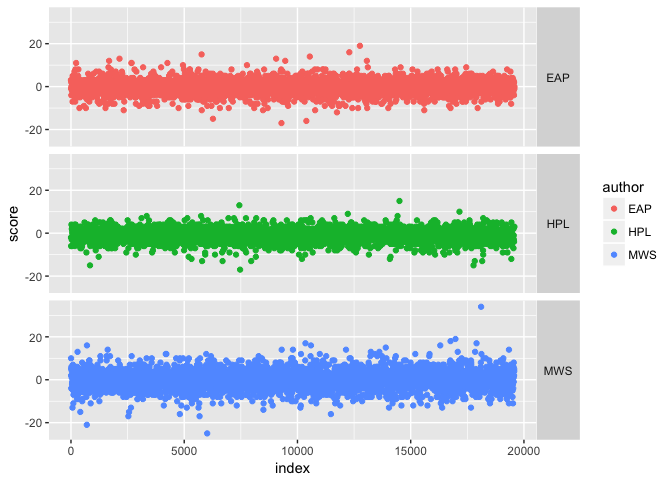<!-- -->
  
The plot above shows the score of each author (in sentence level). MWS is more emotional than others for its larger scale. It seems like that HPL is more negative than EAP and MWS. In order to check this assumption, I got a sum of sentence score.  
##### sentiment score of EAP, HPL, MWS  
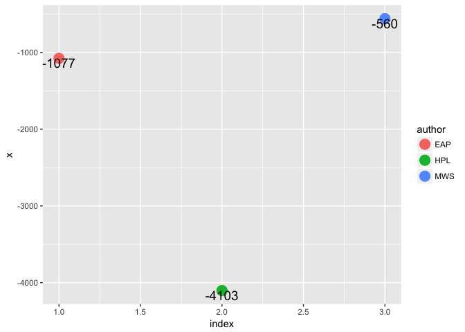<!-- -->
  
Obviously, the HPL gets an lowest score. Undoubtedly, he is very negative. MWS is the most positive author among three people. It is not surperised because in word cloud she shows a lot of positive and emotional words.   


## Specific words  
***
In this part, I select some specific words and analyze their frequencies.  

#### 1.he or she  
***

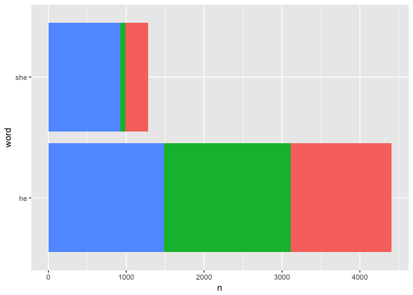<!-- -->
  
The above plot shows that MWS used a lot of "he" and "she", especially for "she". Such phenomena might be related with her gender. Female author might use more "she" than male author. As for "he", three authors use it in almost same level.  

#### 2. Call of Cthulhu  
***
`Call of Cthulhu` is the famous novel of HPL, which talks about the ancient god. I got an list of HPL's favorite god's name from "http://arkhamarchivist.com/wordcount-lovecraft-favorite-words/", and I'd like to test this list.   

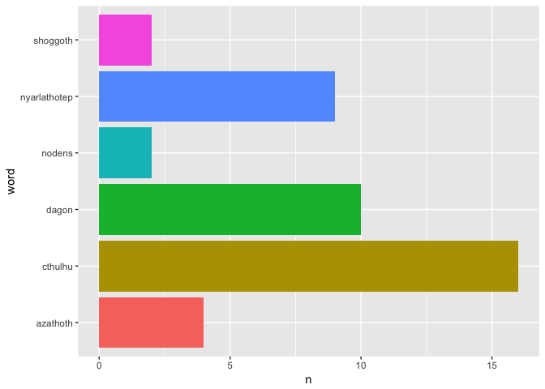<!-- -->
  
This plot shows that `cthulhu` is used frequently as well as `nyarlathotep` and `dagon`. 
